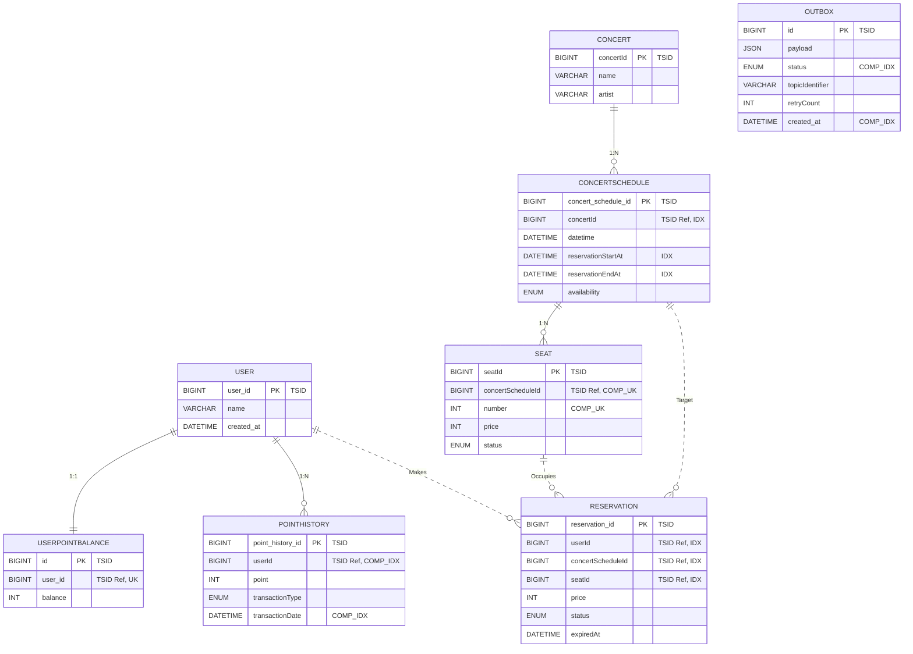

# SLAM! : 콘서트 좌석 예약 서비스

 

콘서트 티켓 오픈 시 발생하는 트래픽 집중과 동시 예약 충돌 상황을 다루는 백엔드 프로젝트입니다.

트래픽 집중 상황에서의 **데이터 정합성 보장**과 **시스템 안정성**에 주안점을 두었습니다.

 

## 목차
1. [주요 기능](#주요-기능)
2. [Technical Highlights](#technical-highlights)
    - [JFR 기반 성능 병목 진단 및 최적화](#1-jfr-기반-성능-병목-진단-및-최적화)
    - [데이터 정합성 보장을 위한 설계](#2-데이터-정합성-보장을-위한-설계)
    - [모듈러 모놀리식 아키텍처](#3-모듈러-모놀리식-아키텍처)
3. [시스템 아키텍처](#시스템-아키텍처)
4. [ERD 및 데이터베이스 설계 전략](#erd)
5. [핵심 비즈니스 로직 (Sequence Diagram)](#핵심-비즈니스-로직-시퀀스-다이어그램---좌석-선점--예약-생성-여정)
6. [Frontend Development with AI](#ai-native-frontend-development)

 

---

## 주요 기능
- **대기열 시스템**: Redis Sorted Set 기반의 대기열로 요청 순서(FIFO)를 보장하며, 공연 일정별 독립적인 대기열 관리를 통해 시스템 부하를 제어합니다.
- **동시성 제어**: Redisson Distributed Lock을 AOP로 설계하여 동시성을 제어하고, Watchdog 기반 TTL 자동 갱신으로 장애 시에도 Stale Lock 없이 안전하게 동작합니다.
- **예약 라이프사이클 관리**: 예약 생성 시 TTL 기반 임시 점유를 부여하고, 스케줄러가 만료된 예약을 자동 정리하여 좌석 리소스를 효율적으로 관리합니다.
- **이벤트 기반 아키텍처**: Transactional Outbox Pattern으로 도메인 이벤트를 안전하게 발행하여, 트랜잭션 원자성을 유지하면서 후속 처리를 비동기로 수행합니다.
- **포인트 결제**: 구현 편의 상, 미리 충전한 사용자 포인트 잔액을 차감하는 형태로 결제가 이루어지도록 설계했습니다.

 

## Technical Highlights

### 1. JFR 기반 성능 병목 진단 및 최적화

- **문제:** 부하 테스트(K6) 중 P99 Latency 급증 (48ms → 1,040ms) 및 간헐적 타임아웃 발생
- **분석:** JFR 프로파일링 및 Grafana 메트릭을 통해 원인 식별
  - **Memory Pressure:** Free Ratio 21% < G1GC MinHeapFreeRatio 40% → JVM의 힙 확장 시도 관측
  - **GC 빈도 과다:** 고부하 시 Allocation Rate 대비 Eden 부족으로 GC 빈도 +164% 증가
  - **Cascade 효과:** GC Pause 중 커넥션 반환 지연 → HikariCP 대기 스레드 90개 적체 확인 (Thread Dump)
- **해결:** Allocation Rate 기반 JVM Heap Resize (512MB → 2GB)
  - Heap 확장 vs 코드 레벨 객체 최적화 중 ROI 및 가용 리소스 고려 Heap 확장 결정.
  - 가설로 지목했던 Memory Pressure 변인 제거 효과를 뚜렷하게 보기위해 큰 폭 증설 -> 이분탐색으로 최적 Heap Size로 반복 실험하며 최적화.
- **결과:** P99 Latency 66% 개선 (1,040ms → 355ms), Throughput 54% 향상 (813 → 1,250 RPS)

| Metric | Before | After | 개선폭 |
| :--- | :---: | :---: | :---: |
| P99 Latency | 1,040 ms | 355 ms | 65% ▼ |
| Throughput | 813 RPS | 1,250 RPS | 53% ▲ |

### 2. 데이터 정합성 보장을 위한 설계
- **Idempotency Key 기반 3-Layer API 멱등성 보장 설계 (Cache → Redis Lock → DB Unique)** : [관련 PR 링크](https://github.com/leonroars/slam/pull/34)
  - 서버 장애와 동시 요청에도 중복 없이 동작하는 결제 & 예약 생성 API 멱등성 설계
- **Transactional Outbox Pattern:** 비즈니스 로직과 이벤트 발행의 원자성 보장 (Spring Scheduler 기반 Polling Publisher 방식 구현)

---

### 3. 모듈러 모놀리식 아키텍처
- **도메인 격리:** `Booking`, `Payment`, `Concert` 간 결합도를 낮추고 Spring Event로 비동기 통신
- **아키텍처 제약:** MSA 전환을 고려해 패키지 레벨에서 도메인 간 직접 참조 제한

 

## 시스템 아키텍처

기술 스택 상세 보기

 

| Category | Technology |
| :--- | :--- |
| Language | Java 17 |
| Framework | Spring Boot 3.2, Spring Data JPA |
| Database | MySQL 8.0, Redis 7.0 |
| Infrastructure | AWS (EC2, RDS, ECR), Docker |
| CI/CD | GitHub Actions |
| Monitoring | Prometheus, Grafana, Loki, Promtail |
| Testing | JUnit 5, Testcontainers, K6 |

 

---

## ERD

### 💡 Key Design Decisions

**1. TSID 참조 기반의 느슨한 결합을 위한 스키마 설계**
 - 도메인 간의 강한 결합을 끊기 위해 물리적 Foreign Key 제약조건을 제거하고, **TSID를 통한 간접 참조 방식**을 채택
 - 이를 통해 각 도메인의 응집도를 높였으며, 향후 **데이터베이스의 물리적 분리나 구조 변경에도 유연하게 대처할 수 있는 확장성**을 확보.

**2. TSID 를 선택한 근거**
- **Performance:** 시간순으로 정렬되는 TSID 특성을 활용하여, 랜덤 UUID 사용 시 발생하는 MySQL(InnoDB)의 **Page Splitting 및 인덱스 파편화 문제** 회피.
- **Efficiency:** 인덱스 스토리지 효율 고려했을 때, 64-bit `BIGINT` 타입에 저장 가능한 TSID 가 유리하다고 판단.

**3. Indexing Strategy (인덱싱 전략)**
- **`CONCERT_SCHEDULE`**: `start <= ? AND end >= ?`와 같은 독립적인 양방향 범위 검색 시, 옵티마이저가 더 효율적인 인덱스를 선택하거나 **Index Merge**를 수행할 수 있도록 `reservationStartAt`, `reservationEndAt`에 각각 **단일 인덱스**를 적용.
- **`SEAT`**: 데이터 무결성 보장을 위해 `(concertScheduleId, number)` 복합 Unique Key 적용
- **`OUTBOX`**: 이벤트 발행 배치의 조회 성능을 위해 카디널리티(Cardinality)를 고려한 `(status, created_at)` 복합 인덱스 적용
---

## 핵심 비즈니스 로직 시퀀스 다이어그램 - 좌석 선점 ~ 예약 생성 여정

  

 

---
## Frontend Development with AI

- **접근 방식:** Antigravity, Claude Code 를 활용한 빠른 프로토타이핑 및 구현
  - API 명세 및 페이지 단위 사용자 여정을 사전 문서화
  - 문서 기반 프롬프트 엔지니어링으로 컴포넌트 설계 및 코드 생성
  - AI 생성 코드의 검토 및 최적화를 통한 품질 확보

- **구현:**
  - React 기반 SPA 구조
  - 좌석 선택 UI 및 실시간 예약 상태 반영
  - 반응형 디자인 적용

- **스크린샷:**

| 좌석 선택 화면 | 예약 확인 화면 |
|:-------------:|:-------------:|
|  |  |
 
