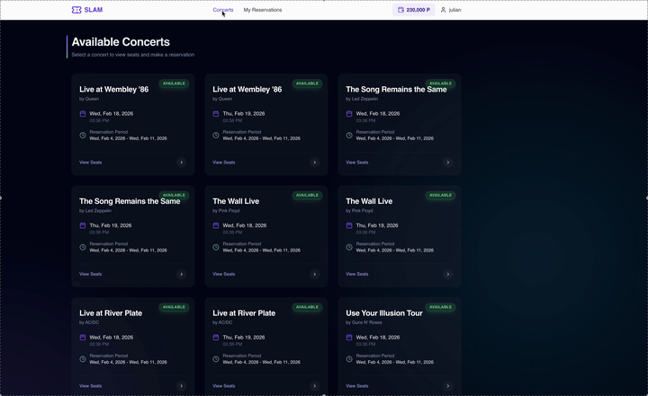
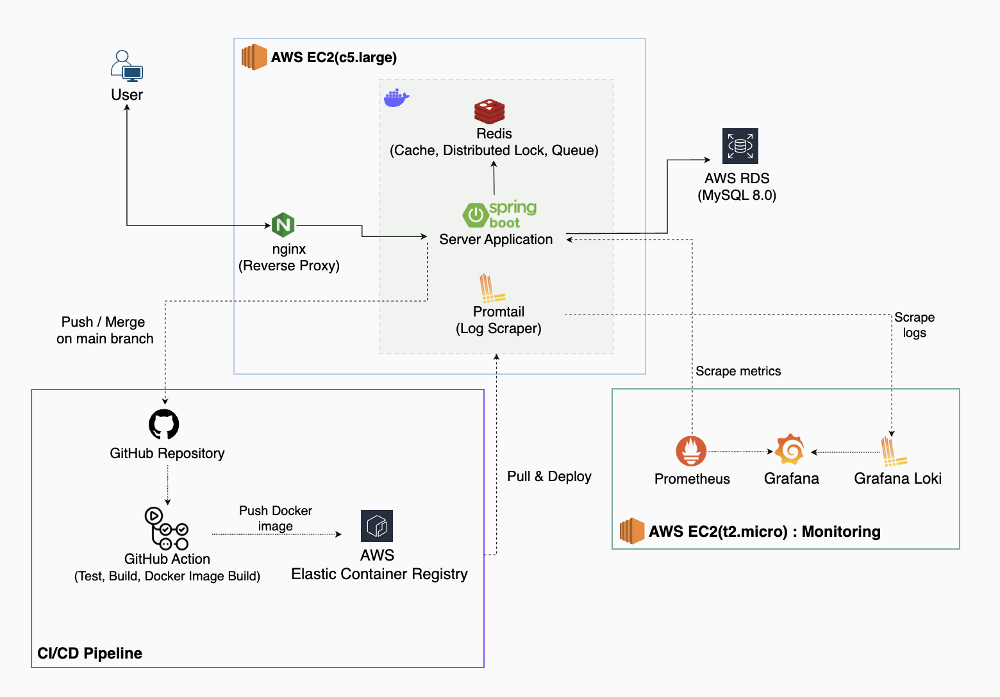

# SLAM - 콘서트 좌석 예약 시스템

> 🇺🇸 [English Documentation](./docs/README.en.md)

#### **_트래픽 급증과 동시 예약 충돌 상황에서도 데이터 정합성을 보장하는 콘서트 좌석 예약 시스템_**

---

## 주요 기능
- **대기열 시스템**: Redis Sorted Set 기반의 대기열로 요청 순서(FIFO)를 보장하며, 공연 일정별 독립적인 대기열 관리를 통해 시스템 부하를 제어합니다.
- **동시성 제어**: Redisson Distributed Lock을 AOP로 설계하여 동시성을 제어하고, Watchdog 기반 TTL 자동 갱신으로 장애 시에도 Stale Lock 없이 안전하게 동작합니다.
- **예약 라이프사이클 관리**: 예약 생성 시 TTL 기반 임시 점유를 부여하고, 스케줄러가 만료된 예약을 자동 정리하여 좌석 리소스를 효율적으로 관리합니다.
- **이벤트 기반 아키텍처**: Transactional Outbox Pattern으로 도메인 이벤트를 안전하게 발행하여, 트랜잭션 원자성을 유지하면서 후속 처리를 비동기로 수행합니다.
- **포인트 결제**: 구현 편의 상, 미리 충전한 사용자 포인트 잔액을 차감하는 형태로 결제가 이루어지도록 설계했습니다.

 

## Technical Highlights

| 과제                          | 성과                                                                                         | 상세 문서                                                                                               |
|-------------------------------|--------------------------------------------------------------------------------------------|-----------------------------------------------------------------------------------------------------|
| 애플리케이션 병목 원인 분석 및 해결 | **P99 Latency 66% 개선** (1.04s → 355ms) / **처리량 53.3% 향상(성능 포화점 기준)** (813 RPS → 1.25K RPS) | [JDK Flight Recorder를 활용한 JVM 성능 병목 분석](./docs/detailed_docs/en/performance-bottleneck-analysis.md) |
| 데이터 정합성을 위한 동시성 제어    | 단위·통합 테스트 및 Grafana K6 부하 테스트를 통해 중복 **0건** 검증                                             | [예약 & 결제 3중 API 멱등성 설계](./docs/detailed_docs/en/idempotency-design.md)                              |

---
## 아키텍처

---
## 기술 스택

> **Backend**: Java 17, Spring Boot 3, Spring Data JPA
>
> **Frontend**: React 기반 SPA (Vite, TypeScript, Tailwind CSS). Claude Code, Antigravity(Gemini 3 Pro)를 활용한 AI 네이티브 개발
>
> **Data**: MySQL 8.0, Redis 7.0 (Redisson)
>
> **Infra**: AWS (EC2, RDS, ECR), Docker, GitHub Actions
>
> **Observability**: Prometheus, Grafana, Grafana Loki & Promtail
>
> **AI Stacks**: 프론트엔드 개발에 Claude Code & Antigravity 활용, CodeRabbit을 통한 AI 기반 PR 리뷰

## 설계 및 구현 상세
- [API 설계](./docs/detailed_docs/kor/api_design.kor.md)
- [데이터베이스 스키마](./docs/detailed_docs/kor/database_design.md)