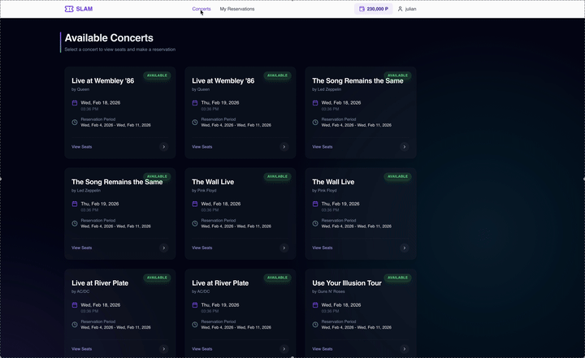
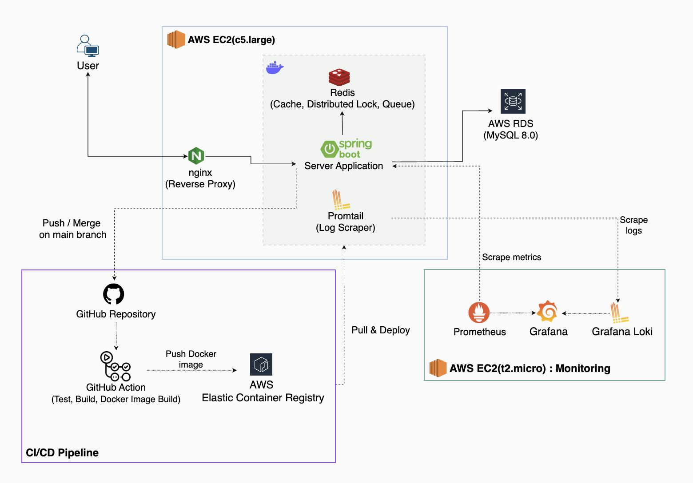

# SLAM - Concert Seat Reservation System

> 🇰🇷 [한국어 문서 링크](../README.md)

 #### **_A concert seat reservation system that handles traffic spikes and concurrent booking conflicts with data consistency guarantees._**

---
## Core Features
> **Per-Schedule Waiting Queue** — Each concert schedule maintains an independent
  Redis Sorted Set queue with FIFO ordering, isolating traffic across events
  and controlling admission via concurrent-user thresholds.
> 
> 
> **Distributed Concurrency Control** — Redisson-based distributed locks applied
  via AOP with Watchdog TTL renewal, preventing double-booking without stale lock risk.
>
> 
> **Exactly-Once Payment & Reservation** — 3-layer defense
    (Response Cache → Distributed Lock → DB Unique Constraint)
    guarantees no duplicate charges or bookings under retries and concurrent requests.
> 
> 
> **Cross-Domain Transaction Integrity** — Separated domains (Booking, Payment, Concert)
    coordinate via async events with Transactional Outbox for atomic publishing
    and compensation logic on failure.

## Key Technical Highlights

| Challenge                                | Result                                                                              | Deep-dive                                                                                                              |
|------------------------------------------|-------------------------------------------------------------------------------------|------------------------------------------------------------------------------------------------------------------------|
| Application Bottleneck RCA & Resolution  | **P99 Latency -66%** (1.04s → 355ms) / **Throughput +53.3%** (813 RPS -> 1.25K RPS) | [JVM Performance Bottleneck Analysis using JDK Flight Recorder](./detailed_docs/en/performance-bottleneck-analysis.md) |
| Concurrency Control for Data consistency | **Zero** duplicates verified with both unit/integration tests & Grafana K6          | [3-Layer API Idempotency for reservation & payment](./detailed_docs/en/idempotency-design.md)                          |

---
## Architecture

---
## Tech Stack

> **Backend**: Java 17, Spring Boot 3, Spring Data JPA
>
> **Frontend**: React-based SPA (Vite, TypeScript, Tailwind CSS). AI Native Development with Claude code, Antigravity with Gemini 3 Pro
>
> **Data**: MySQL 8.0, Redis 7.0 (Redisson)
>
> **Infra**: AWS (EC2, RDS, ECR), Docker, GitHub Actions
>
> **Observability**: Prometheus, Grafana, Grafana Loki & Promtail
> 
> **AI Stacks**: Claude Code & Antigravity for frontend development, CodeRabbit for AI-powered PR review

## Design & Implementation Details
- [API Design](./detailed_docs/en/api_design.md)
- [Database Schema](./detailed_docs/en/database_design.md)
