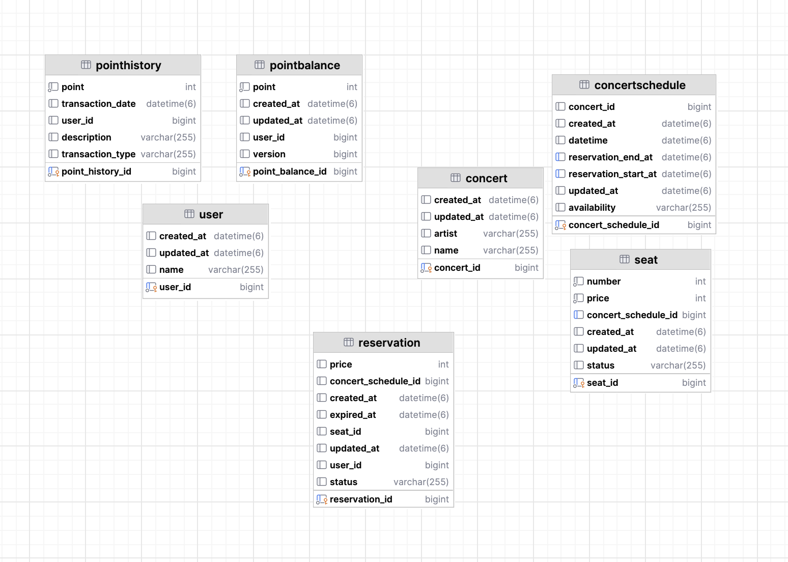

# Database Schema Design

## Overview

The system uses **9 tables** across 4 logical domains to support a concert seat reservation platform. The schema is designed around two constraints: **data integrity under concurrent access** and **loose coupling between domains** to keep each domain independently evolvable.



---

## Design Decisions

### 1. No Physical Foreign Keys

All cross-table references are **logical** (application-level TSID values), with no `FOREIGN KEY` constraints in the DDL. This was a deliberate choice:

- Each domain (User, Concert, Reservation, Queue) owns its own tables and can be evolved or physically split without schema-level coupling.
- Referential integrity is enforced at the application/domain layer instead.
- This trade-off accepts the risk of orphaned references in exchange for domain independence and operational flexibility.

### 2. TSID as Primary Key Strategy

Most tables use application-generated **TSID** (Time-Sorted ID, via `io.hypersistence.tsid`) stored as `BIGINT`:

- **B-tree friendly**: TSIDs are monotonically increasing, which avoids the random-write pattern and page splitting that random UUIDs cause in InnoDB clustered indexes.
- **Storage efficient**: 64-bit `BIGINT` versus 128-bit UUID reduces index size.
- **Application-generated**: IDs are assigned before persistence, which allows the domain model to reference entities before they are saved.

Exceptions: `POINTBALANCE` and `QUEUE` use database `AUTO_INCREMENT` instead of TSID.

### 3. Optimistic Locking on Point Balance

`POINTBALANCE` uses a JPA `@Version` field for optimistic concurrency control. When two concurrent transactions attempt to modify the same user's balance, one will fail with an `OptimisticLockException` and can be retried. This avoids holding database-level locks during the transaction.

### 4. Auditing

A `BaseJpaEntity` mapped superclass provides `created_at` and `updated_at` via Spring Data JPA's `@CreatedDate` / `@LastModifiedDate` auditing. All tables except `POINTHISTORY` inherit from this base entity.

### 5. Enum Storage

Domain enums (`SeatStatus`, `ReservationStatus`, `TokenStatus`, etc.) are stored as `VARCHAR` strings rather than ordinal integers. This makes the raw data human-readable and protects against enum reordering breaking stored values.

### 6. Indexing Strategy

| Table | Index | Columns | Purpose |
|-------|-------|---------|---------|
| `CONCERTSCHEDULE` | `IDX_RESERVATION_START_AT` | `reservationStartAt` | Narrows scan range for reservation window queries. Given domain characteristics (concurrent reservable schedules realistically limited to hundreds), single-column index on `start_at` provides sufficient selectivity without composite index overhead. |
| `SEAT` | `IDX_SEAT_CONCERT_SCHEDULE_ID` | `concertScheduleId` | Lookup of all seats for a given schedule |

---
## Key Tables Specifications

### User Domain

#### `POINTBALANCE`
| Column | Type | Constraint | Description |
|--------|------|------------|-------------|
| `point_balance_id` | BIGINT | PK, AUTO_INCREMENT | |
| `user_id` | BIGINT | | Logical reference to `USER.user_id` |
| `point` | INT | | Current balance (0 ~ 1,000,000) |
| `version` | BIGINT | | `@Version` for optimistic locking |
| `created_at` | DATETIME(6) | NOT NULL, auto | JPA auditing |
| `updated_at` | DATETIME(6) | auto | JPA auditing |

- **Optimistic locking** is applied via JPA `@Version` to handle concurrent point charge/use operations without pessimistic locks.
- The balance range (0 to 1,000,000) is enforced at the domain model level (`Point` value object), not at the database constraint level.

#### `POINTHISTORY`
| Column | Type | Constraint | Description |
|--------|------|------------|-------------|
| `point_history_id` | BIGINT | PK (TSID) | Application-generated TSID |
| `user_id` | BIGINT | | Logical reference to `USER.user_id` |
| `point` | INT | | Transaction amount |
| `transaction_type` | VARCHAR(255) | | `CHARGE`, `USE`, `INIT` |
| `description` | VARCHAR(255) | | |
| `transaction_date` | DATETIME(6) | | |

- Append-only log of point transactions.
- Does not extend `BaseJpaEntity` (no `created_at` / `updated_at` auditing); uses its own `transaction_date` field instead.

---

### Concert Domain

#### `CONCERTSCHEDULE`
| Column | Type | Constraint | Description |
|--------|------|------------|-------------|
| `concert_schedule_id` | BIGINT | PK (TSID) | Application-generated TSID |
| `concert_id` | BIGINT | | Logical reference to `CONCERT.concert_id` |
| `availability` | VARCHAR(255) | | `AVAILABLE`, `SOLDOUT` |
| `datetime` | DATETIME(6) | | Performance date/time |
| `reservation_start_at` | DATETIME(6) | Composite Index | Reservation window open |
| `reservation_end_at` | DATETIME(6) | Composite Index | Reservation window close |
| `created_at` | DATETIME(6) | NOT NULL, auto | JPA auditing |
| `updated_at` | DATETIME(6) | auto | JPA auditing |

- **Index `IDX_RESERVATION_AVAILABLE_PERIOD`** on `(reservationStartAt, reservationEndAt)` — supports range queries that filter schedules within an available reservation window.

#### `SEAT`
| Column | Type | Constraint | Description |
|--------|------|------------|-------------|
| `seat_id` | BIGINT | PK (TSID) | Application-generated TSID |
| `concert_schedule_id` | BIGINT | Index | Logical reference to `CONCERTSCHEDULE` |
| `number` | INT | | Seat number within the schedule |
| `price` | INT | | Seat price |
| `status` | VARCHAR(255) | | `AVAILABLE`, `UNAVAILABLE` |
| `created_at` | DATETIME(6) | NOT NULL, auto | JPA auditing |
| `updated_at` | DATETIME(6) | auto | JPA auditing |

- **Index `IDX_SEAT_CONCERT_SCHEDULE_ID`** on `(concertScheduleId)` — used when loading all seats for a given schedule.

---

### Reservation Domain

#### `RESERVATION`
| Column | Type | Constraint | Description |
|--------|------|------------|-------------|
| `reservation_id` | BIGINT | PK (TSID) | Application-generated TSID |
| `user_id` | BIGINT | | Logical reference to `USER.user_id` |
| `concert_schedule_id` | BIGINT | | Logical reference to `CONCERTSCHEDULE` |
| `seat_id` | BIGINT | | Logical reference to `SEAT` |
| `price` | INT | | Payment amount |
| `status` | VARCHAR(255) | | See state machine below |
| `expired_at` | DATETIME(6) | | TTL deadline for preempted reservations |
| `created_at` | DATETIME(6) | NOT NULL, auto | JPA auditing |
| `updated_at` | DATETIME(6) | auto | JPA auditing |

**Reservation status state machine:**

```
PREEMPTED ──→ PAYMENT_PENDING ──→ CONFIRMED ──→ CANCELLED
    │
    └──→ EXPIRED
```

- `PREEMPTED`: Seat is temporarily held. `expired_at` is set to `created_at + 5 minutes`.
- `PAYMENT_PENDING`: Payment process has started. This intermediate state defends against message reordering when using non-FIFO message queues.
- `CONFIRMED`: Payment succeeded.
- `EXPIRED`: The 5-minute hold elapsed without payment. A scheduler reclaims the seat.
- `CANCELLED`: A confirmed reservation was cancelled.
- Rollback transitions (`CONFIRMED → PREEMPTED`, `EXPIRED → PREEMPTED`, `CANCELLED → CONFIRMED`) exist in the domain model to support compensating actions on failure.

---

### Queue Domain

#### `QUEUE`
| Column | Type | Constraint | Description |
|--------|------|------------|-------------|
| `id` | BIGINT | PK, AUTO_INCREMENT | |
| `concert_schedule_id` | BIGINT | | Scoped to a specific schedule |
| `user_id` | BIGINT | | Logical reference to `USER.user_id` |
| `status` | VARCHAR(255) | | `WAIT`, `ACTIVE`, `EXPIRED` |
| `expired_at` | DATETIME(6) | | Token expiration time |
| `created_at` | DATETIME(6) | NOT NULL, auto | JPA auditing |
| `updated_at` | DATETIME(6) | auto | JPA auditing |

- Manages token-based admission control per concert schedule.
- Token durations and max concurrent user counts are externalized via `QueuePolicy` configuration properties.

